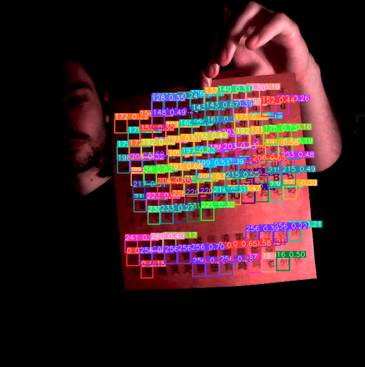

# Arche Reading - YOLOv5

Using YOLOv5 to train and run detection scripts, transforming encrypted text data into sound.

## Commands

### Detection directly from webcam

`python detect.py --weights best.pt --source 0`

### Detection from video stream

Using [cam2ip](https://github.com/gen2brain/cam2ip) application to use wbecam to stream video to ip address:

`python detect.py --weights best.pt --source 'http://localhost:3333/mjpeg?.mjpeg'`